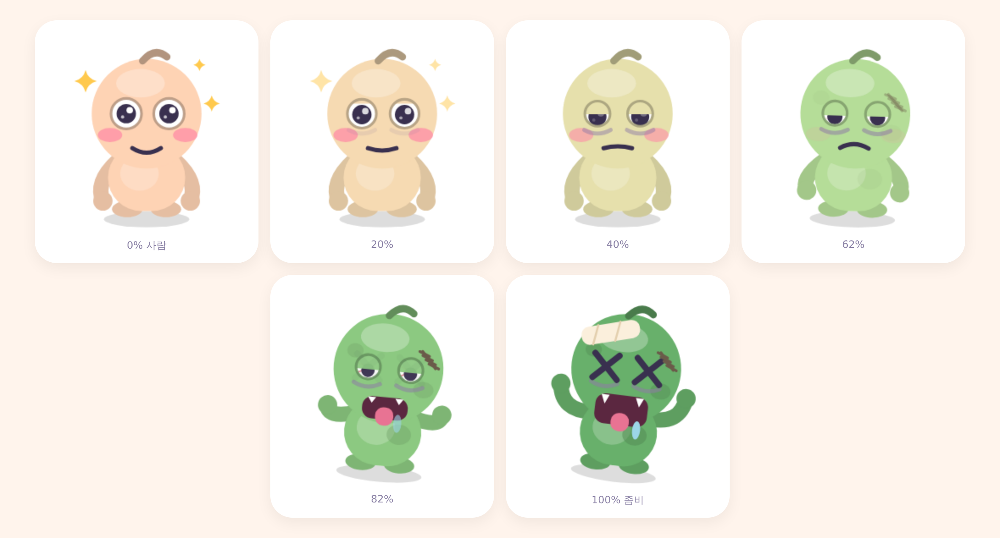
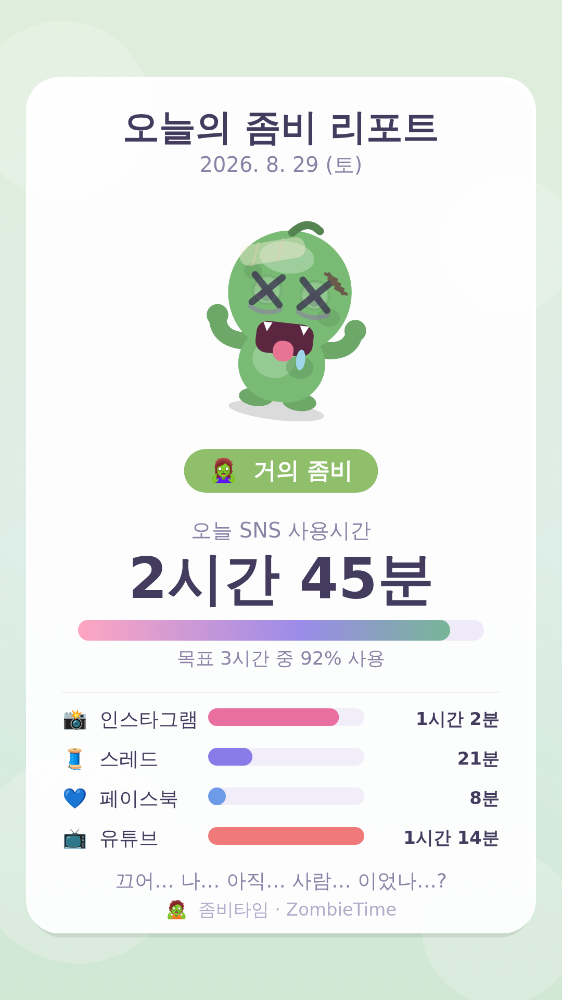

# 🧟 좀비타임 (ZombieTime)

SNS를 볼수록 귀여운 캐릭터가 좀비로 변해가는 안드로이드 앱.

인스타그램 · 스레드 · 페이스북 · 유튜브의 **화면에 실제로 떠 있던 시간**을 모두 합쳐서,
하루 목표(기본 3시간)에 가까워질수록 캐릭터가 사람 → 좀비로 연속적으로 변합니다.



---

## 주요 기능

| 기능 | 설명 |
|---|---|
| 스크린타임 수집 | `UsageStatsManager` 이벤트 기반 포그라운드 시간 집계 (백그라운드 재생 제외) |
| 상시 배너 | 포그라운드 서비스 + 상시 알림. 잠금화면/알림창에 캐릭터 그림 + 단계 + 사용시간 + 진행바를 1분마다 갱신 |
| 단계 알림 | 인간 → 좀비 6단계를 넘어갈 때마다 캐릭터 대사와 함께 푸시 |
| 앱별 상세 | 인스타/스레드/페북/유튜브 각각 사용시간 막대그래프 |
| 주간 통계 | 최근 7일 막대그래프 + 4주 좀비 캘린더 + 앱별 주간 합계 |
| 하루 브리핑 | 매일 밤(기본 22시) 1080×1920 리포트 카드를 만들어 **인스타 스토리로 바로 공유** |
| 설정 | 목표 시간(1~8시간), 브리핑 시각, 알림 on/off |

캐릭터는 이미지 파일이 아니라 `CharacterRenderer` 가 **캔버스에 직접 그리는 벡터**라서
화면·알림 아이콘·스토리 카드가 전부 같은 그림을 어떤 해상도로든 선명하게 씁니다.

### 하루 브리핑 카드 (인스타 스토리용)



---

## APK 만들기 (GitHub Actions)

1. GitHub에서 **새 저장소**를 만듭니다 (private 도 됩니다).
2. 이 폴더 전체를 그 저장소에 올립니다.

```bash
cd zombietime
git init
git add .
git commit -m "좀비타임 첫 커밋"
git branch -M main
git remote add origin https://github.com/<본인아이디>/<저장소이름>.git
git push -u origin main
```

3. push 하면 **Actions** 탭에서 `Build APK` 워크플로가 자동으로 돕니다 (약 5~8분).
4. 끝나면 두 곳 중 편한 데서 받으면 됩니다.
   - **Releases → `latest`** → `zombietime-release.apk` (폰 브라우저로 바로 받기 좋음)
   - Actions 실행 화면 맨 아래 **Artifacts → zombietime-apk**

> 디버그 키로 서명된 APK라서 설치할 때 "출처를 알 수 없는 앱" 허용이 한 번 필요합니다.
> Play 스토어에 올리려면 별도 릴리스 키스토어로 서명해야 합니다.

### Android Studio 로 여는 경우

그냥 이 폴더를 열고 Run 하면 됩니다. (JDK 17, AGP 8.5.2, Gradle 8.9)

---

## 설치 후 첫 실행

앱이 두 가지 권한을 요청합니다.

1. **사용 정보 접근** — 안드로이드 설정 화면이 열리면 목록에서 `좀비타임`을 찾아 켜주세요.
   (이 권한은 시스템 설정에서만 켤 수 있어서 팝업으로 처리할 수 없습니다.)
2. **알림** — 상시 배너를 띄우기 위해 필요합니다.

둘 다 켜면 바로 배너가 뜨고 캐릭터가 살아납니다.

> 삼성/샤오미 등 일부 기기는 배터리 최적화가 서비스를 종료시킬 수 있습니다.
> 배너가 사라지면 `설정 → 배터리 → 좀비타임 → 제한 없음` 으로 바꿔주세요.

---

## 좀비화 단계

| 단계 | 목표 대비 | 이름 |
|---|---|---|
| 0 | 0~10% | 말짱한 사람 |
| 1 | 10~30% | 살짝 몽롱 |
| 2 | 30~50% | 눈이 풀림 |
| 3 | 50~72% | 피부가 초록 |
| 4 | 72~92% | 거의 좀비 |
| 5 | 92%+ | 완전 좀비 |

---

## 프로젝트 구조

```
app/src/main/java/com/zombietime/app/
├── MainActivity.kt              화면 전환 · 상태 관리 · 권한 요청
├── ZombieApp.kt                 Application (채널/알람 초기화)
├── Notifications.kt             상시 배너 · 단계 알림 · 브리핑 알림
├── character/
│   └── CharacterRenderer.kt     인간→좀비 벡터 캐릭터 드로잉 (핵심)
├── data/
│   ├── Models.kt                추적 대상 앱 · 시간 포맷
│   ├── ZombieStage.kt           단계 정의 · 대사
│   ├── Prefs.kt                 설정 및 일별 기록 저장
│   └── UsageRepository.kt       UsageStatsManager 집계
├── service/
│   ├── ZombieMonitorService.kt  1분 주기 갱신 포그라운드 서비스
│   ├── BootReceiver.kt          재부팅 후 자동 시작
│   ├── BriefingAlarm.kt         매일 브리핑 알람 예약
│   └── DailyBriefingReceiver.kt 브리핑 발송
├── share/
│   ├── StoryImageBuilder.kt     1080×1920 스토리 카드 생성
│   └── ShareHelper.kt           인스타 ADD_TO_STORY + 폴백 공유
└── ui/                          Compose 화면 (홈/주간/설정/온보딩/브리핑)
```

## 개인정보

모든 사용 기록은 기기 내 `SharedPreferences` 에만 저장됩니다.
네트워크 권한 자체가 없어서 어디로도 전송되지 않습니다.
